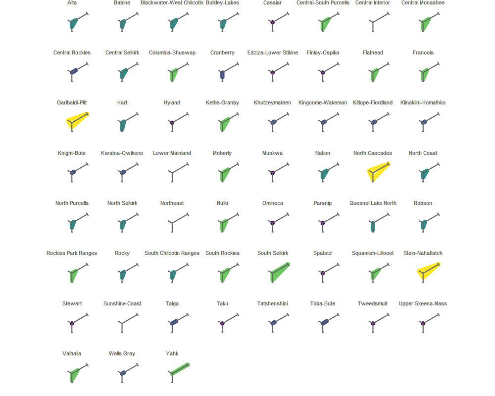
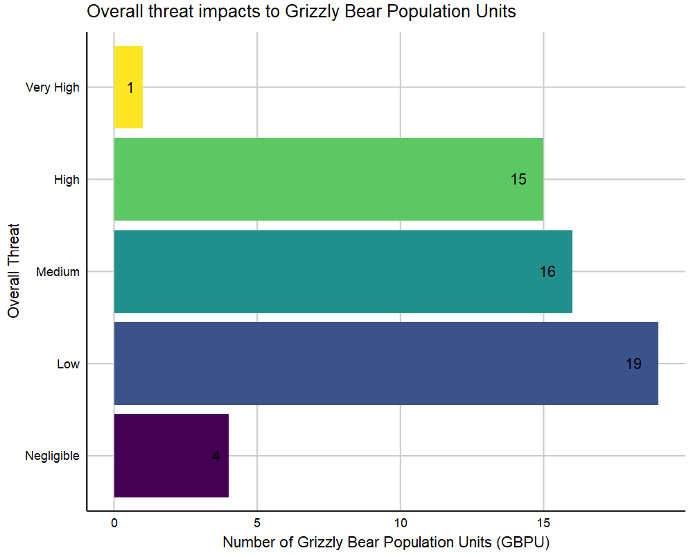
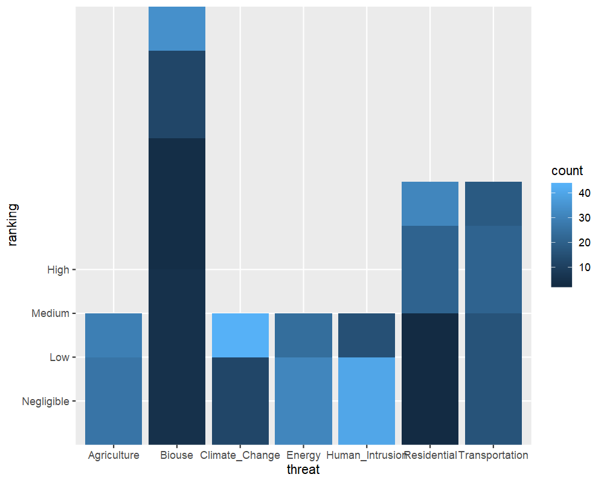

<!--
# Copyright 2019 Province of British Columbia
#
# Licensed under the Apache License, Version 2.0 (the "License");
# you may not use this file except in compliance with the License.
# You may obtain a copy of the License at
#
# http://www.apache.org/licenses/LICENSE-2.0
#
# Unless required by applicable law or agreed to in writing, software distributed under the License is distributed on an "AS IS" BASIS,
# WITHOUT WARRANTIES OR CONDITIONS OF ANY KIND, either express or implied.
# See the License for the specific language governing permissions and limitations under the License.

-->
```{r set-options, echo=FALSE, cache=FALSE, warning=FALSE, message=FALSE}

library(ggplot2)
library(dplyr)
library(here)
library(knitr)
library(tidyverse)
library(leaflet)
library(sf)
library(geojsonio)
library(htmltools)
library(mapview)
library(DT)
library(envreportutils)
library(envreportutils.internal)


#if (!exists("threat_sum_plot")) load(here("tmp", "plots.RData"))
grizzdata_full <- read_rds(here("data/grizzdata_full.rds"))
grizzdata_full <- st_transform(grizzdata_full, crs = 4326) 
grizz.df <- as.data.frame(grizzdata_full)
grizz.df <- grizz.df %>%
  filter(status == "Viable")


```

* **Grizzly bears are an important part of the British Columbia landscape.** 
  + They are a symbol of ecological integrity that represents much of what British Columbians and visitors alike appreciate about B.C.’s natural beauty.
  +	B.C. is host to some of North America’s last remaining places where large predators and their prey play out their millennia-old roles. Grizzly bears are a key part of these systems.
  + Grizzly bears are listed as a ‘Species of Concern’ under federal legislation ((SARA; 2018) and ranked as S3 (Vulnerable Uncertain) in B.C (REF) 

* **Within B.C., grizzly bears are divided into 55 Grizzly Bear Population Units (GBPUs)** These units range from 2,670 km^2^ to 49,578 km^2^. They enable managers to identify local conservation concerns, track grizzly bear population trends and apply specific management practices.

* **GBPUs are ranked from low to extreme conservation concern.** Rankings are determined using internationally recognized methods developed by NatureServe^2^ and IUCN. GBPU conservation rankings are based on; 1) population size and isolation,  2) population trend, and 3) level of threat to bears or bear habitat. The level of threat considered seven sub-categories, including Residential, Agriculture, Energy, Transportation, Biological Use, Human intrusion and Climate Change. See below for detailed methodology^1^. 

* **Human development is the greatest threat to Grizzly bears in B.C.** Development can impacts bears directly; by increasing frequency of bear and human conflict and indirectly through habitat availability. The expansion of human settlements and agriculture can lead to isolation of grizzly bear populations and degradation or loss of habitat either directly or by avoidance by bears. 
  

\newpage

### Conservation Concern 


```{r cons_map, echo = FALSE, warning = FALSE, error = FALSE, message = FALSE, fig.cap = "Conservation Concern Ranking for Grizzly Bear Population units (GBPU)", results = 'asis', out.width='0.95\\linewidth', fig.align = 'center'}

knitr::include_graphics("./cons_splot.png")

```


Of the 55 Grizzly Bear Population units (GBPU), conservation concern is ranked as extreme for three GBPUs, high for 14 GBPU and moderate for 14 GBPUs with the remainder of lower conservation concern. Refer to Appendices for full dataset.


\newpage

### Population Density Estimate


``` {r pop map, warning=FALSE, echo = FALSE, error = FALSE, message = FALSE, fig.cap = "Grizzly bear population density (adults/1000 km2) per GBPU" , results = 'asis', out.width='0.95\\linewidth', fig.align = 'center', }

knitr::include_graphics("./pop_splot.png")

```

Grizzly Bear population density ranged from 1 - 49 adults/1000 km^2^. North Selkirk
GBPU had the highest population density.

\newpage

### Threat Classification


``` {r threat map, warning=FALSE, echo = FALSE, error = FALSE, message = FALSE, results = 'asis', fig.cap = "Grizzly bear overall threat classification", out.width='0.95\\linewidth', fig.align = 'center'}

knitr::include_graphics("./threat_splot.png")

```

Approximately half of the GBPU (23 GBPUs) were idenitified as an overall threat of Low or Negligible. Yahk GBPU, located in the Kooteney-Boundary, had the highest overall threat due to combined risks of Agriculture, Human intrusion, Residential, Transportation and Biological Use. 


```{r threat_detail, echo = FALSE, message=FALSE, fig.align='center', out.width='0.99\\linewidth'}




```


```{r radar_key, echo = FALSE, message=FALSE, fig.align='right', fig.cap = "Influence of three contributing factors to conservation concern ranking per GBPU. Contributing factors include population trend, population size and isolation and overall threat.", out.width='0.30\\linewidth'}

knitr::include_graphics("./radar_plot_key.png")


```


\newpage

## Summary of threats to Grizzly Bears


```{r image-ref-for-in-text, echo = FALSE, message=FALSE, fig.align='center', out.width='0.70\\linewidth'}



```

Across all GBPUs, Human Intrusion was the most common threat category, followed by Transportation (road and rail density), Energy production and mining, Agriculture (livestock density), Residential (human density), Biological Use (mortality), and Climate-change (salmon decline).

```{r threat sum plot ,echo = FALSE, message=FALSE, fig.align='center', out.width='0.70\\linewidth'}



```


## Methods

* Conservation concern ranks were calculated based on NatureServe’s ‘Element Rank Calculator’^2^ in conjunction with Provincial bear biologists.This ensured rankings were consistent with  international standards (B.C. Conservation Data Centre, NatureServe, and IUCN). 


* Each GBPU was assigned a rank based on population size and trend, genetic and demographic isolation, and overall threat to grizzly bears and bear habitat. GBPUs started with a score of 5 (no conservation concern) with points deduced for 1) declining population trend, 2) small and/or isolated population, and 3) increasing overall threat.


* Population trend was measured over 3 generations (~30 years). If the population decreased by more than 25% the overall score was reduced, leading to increased concern ranking. 

*	Population size and isolation are combined such that smaller isolated population’s rank scores can be reduced by as much as 4 points, whereas large well connected populations are not downgraded.

*	We determined threats using categories identified by IUCN-CMP (Conservation Measures Partnership) . Threats were quantified using published spatial data, including Statistics Canada, B.C.’s Baseline Thematic Mapping, Digital Road Atlas, Fish and Wildlife hunter and mortality data and Federal Department of Fisheries and Oceans’ Salmon escapement. The NatureServe calculator combined individual threats into an overall threat class.[The NatureServe calculator](https://www.natureserve.org/conservation-tools/conservation-rank-calculator) combined individual threats into an overall threat class.


\newpage

## References and Other Useful Links

*^1^ 2019 Ranking the Conservation Concern of Grizzly Bear Population Units report[add link].

*^2^ NatureServe. 2015. [NatureServe Element Occurrence Viability Calculator Version 1](http://www.natureserve.org/conservation-tools/conservation-rank-calculator). NatureServe, Arlington, VA.

*British Columbia conservation Foundation's Bear Aware Program [Link](https://wildsafebc.com/grizzly-bear/)

*British Columbia Ministry of Environment. 2016. British Columbia guide to recovery planning for species and ecosystems at risk. B.C. Ministry of Environment, Victoria, BC. [PDF](http://a100.gov.bc.ca/pub/eirs/finishDownloadDocument.do?subdocumentId=10332)


## Data

\*By accessing these datasets, you agree to the licence associated with each file, as indicated in parentheses below.

- [Grizzly Bear Population Units](https://catalogue.data.gov.bc.ca/dataset/grizzly-bear-population-units)

- [Grizzly Bear Threat Calculations](https::// TO BE UPLOADED)

- [DataBC](https://catalogue.data.gov.bc.ca/dataset?download_audience=Public) 
 –- [Digital Road Atlas](https://www2.gov.bc.ca/gov/content/data/geographic-data-services/topographic-data/roads), mining and energy infrastructure , [BTM – urban and agriculture areas] (link)
-	[Statistic Canada](https://www150.statcan.gc.ca/n1//en/type/data?MM=1#tables) – human and livestock density
-	FLNRORD Fish and Wildlife data – hunter day density, grizzly bear mortality
-	Provincial Cumulative Effects data – Mid-seral forest, Front country
-	Government of Canada - [Salmon escapement database](https://open.canada.ca/data/en/dataset/c48669a3-045b-400d-b730-48aafe8c5ee6#targetText=The%20Salmon%20Escapement%20Database%20(NuSEDS,freshwater%20location%20and%20run%20timing).


----

Published and Available On-Line at Environmental Reporting BC (October 2019):  
<http://www.env.gov.bc.ca/soe/indicators/plants-and-animals/grizzly-bears.html>

Email correspondence to: envreportbc@gov.bc.ca

*Suggested Citation*:  
Environmental Reporting BC. `r format(Sys.Date(), "%Y")`. Grizzly Bear Population Status in B.C. State of Environment Reporting, Ministry of Environment and Climate Change Strategy, British Columbia, Canada.


\newpage 

# Appendices

### Table 1: Conservation Concern Ranking for Grizzly Bear Population Units. Note extirpated GBPUs are not include.  

```{r table 1, echo = FALSE}
# output tables
table1 <- dplyr::select(grizz.df, gbpu_name, con_stats, threat_class,
                               isolation, trend) %>%
  rename("Population Name" = gbpu_name,
         "Conservation Concern" = con_stats,
         "Overall Threat" = threat_class,
         "Isolation" = isolation,
         "Trend" = trend)

knitr::kable(
  table1 
)

```


\newpage 

## Table 2: Population Density Estimates per GBPU in B.C. Note extripated GBPUs not included.

```{r, echo = FALSE}
table2 <- dplyr::select(grizz.df, gbpu_name, gbpu.pop,
                             pop_density, use_area_sq_km,
                             area_sq_km) %>%
  rename("Population Name" = gbpu_name,
         "Population Size (Adults)" = gbpu.pop,
         "Population Density (Adults/1000 km^2)" = pop_density,
         "Area of Useable Habitat (km^2)" = use_area_sq_km,
         "Total Area of GBPU (km^2)" = area_sq_km) 

knitr::kable(
  table2 
)

```

\newpage

## Table 3: Threat Level for threat catergories per GBPU. Threats rank from Very High to Negligible. Note extirpated GBPUs are not include. 

```{r table3, echo = FALSE, warnings = FALSE }

table3 <- grizz.df %>%
  select(gbpu_name, threat_class,ends_with("calc")) %>%
  rename(
    "Population Name" = gbpu_name,
    "Overall Threat" = threat_class,
    "Residential" = residentialcalc,
    "Agriculture" = agriculturecalc,
    "Energy" = energycalc,
    "Transportation" = transportationcalc,
    "Biological Use" = biousecalc,
    "Human Intrusion" = humanintrusioncalc,
    "Climate Change" = climatechangecalc
  )

knitr::kable(
  table3
)

```

